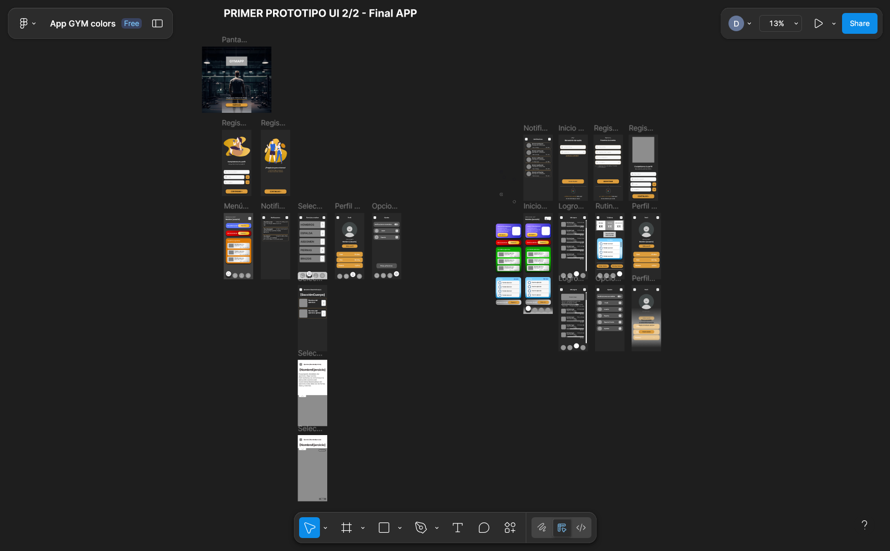

# 🏋️‍♂️ 3D Gym Companion (Android)



[](https://www.android.com/)
[](https://github.com/pintomultimedia2002)
[](LICENSE)

> **[English]** An optimized 3D fitness application focused on performance and visual clarity.
> **[Español]** Una aplicación de fitness 3D optimizada, enfocada en el rendimiento y la claridad visual.

---

## 📸 Preview / Vista Previa


*(Please update this path with your actual screenshot / Por favor actualiza esta ruta con tu captura real)*

---

## 🇬🇧 English Description

**3D Gym Companion** is a lightweight Android application designed to guide users through their workout routines using interactive 3D models. Unlike heavy fitness apps, this project focuses on **resource optimization**, ensuring smooth performance even on mid-range or older devices.

### Key Features

* **3D Exercise Visualization:** Clear 3D models to demonstrate proper form and technique.
* **High Performance:** Optimized rendering pipeline to consume minimal RAM and battery.
* **Exercise Library:** A curated list of gym exercises with detailed instructions.
* **User-Friendly Interface:** Simple navigation focused on the workout experience.

### Tech Stack

* **OS:** Android
* **Rendering:** Optimized 3D Engine (Low-poly assets).
* **Language:** [Kotlin / Java / C# - Specify your language here]

---

## 🇪🇸 Descripción en Español

**3D Gym Companion** es una aplicación ligera para Android diseñada para guiar a los usuarios en sus rutinas de entrenamiento mediante modelos 3D interactivos. A diferencia de otras aplicaciones pesadas, este proyecto se centra en la **optimización de recursos**, asegurando un rendimiento fluido incluso en dispositivos de gama media o antiguos.

### Características Principales

* **Visualización de Ejercicios en 3D:** Modelos 3D claros para demostrar la forma y técnica correcta.
* **Alto Rendimiento:** Pipeline de renderizado optimizado para consumir el mínimo de RAM y batería.
* **Biblioteca de Ejercicios:** Una lista curada de ejercicios de gimnasio con instrucciones detalladas.
* **Interfaz Intuitiva:** Navegación sencilla enfocada en la experiencia de entrenamiento.

### Tecnologías

* **SO:** Android
* **Renderizado:** Motor 3D Optimizado (Assets Low-poly).
* **Lenguaje:** [Kotlin / Java / C# - Especifica tu lenguaje aquí]

---

## 👥 Authors / Autores

This project was built by a dedicated team of developers. / Este proyecto fue construido por un equipo dedicado de desarrolladores.

| Name / Nombre                | Role / Rol     | Links                                                                                                                                                                                                                                          |
| :--------------------------- | :------------- | :--------------------------------------------------------------------------------------------------------------------------------------------------------------------------------------------------------------------------------------------- |
| **David Pinto Gómez** | Developer | [](https://www.linkedin.com/in/pinto-gomez-david/) [](https://github.com/pintomultimedia2002) |
| **Oscar Robles**       | Developer      | [GitHub Profile](#)                                                                                                                                                                                                                               |
| **[Name 3]**           | Leader         | [Link](#)                                                                                                                                                                                                                                         |
| **[Name 4]**           | Developer         | [Link](#)                                                                                                                                                                                                                                         |

---

## ⬇️ Installation / Instalación

To run this project locally: / Para correr este proyecto localmente:

1. Clone the repository / Clona el repositorio:
   ```bash
   git clone [https://github.com/pintomultimedia2002/YOUR-REPO-NAME.git](https://github.com/pintomultimedia2002/YOUR-REPO-NAME.git)
   ```
2. Open the project in Android Studio (or Unity).
3. Build and Run on your Android Device/Emulator.

---

## 📄 License

This project is licensed under the MIT License - see the [LICENSE](LICENSE) file for details.
